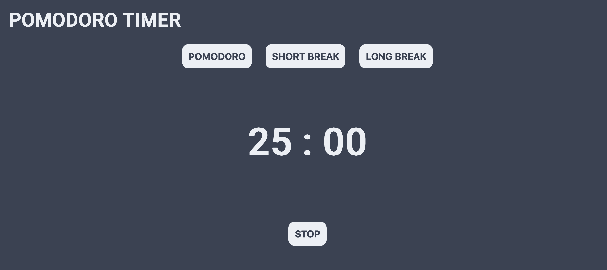

# To-Do List
This is a simple pomodoro timer application built in HTML, CSS, and Javascript. It allows the user to start a pomodoro timer for 25 minutes, take a short break of 5 mintues, or take a long break of 15 minutes.

# Motivation
I often use the pomodoro techinique while studying/working. There are quite a few pomodoro timer applications available but I was in search of one with a minimal design. I decided to build my own to learn more about creating button listeners in Javascript.

# Build Status
All basic functionality has been added. In the future, I plan to add the following features:
- Alarm sound (with options) when timer is completed 
- Update colour scheme for a more professional look
- Variable pomodoro length
- A pomodoro counter to track progress
- Integrate a simple to-do list application underneath for an all-in-one study assistance application

# Screenshots

# Tech
**Built With**
- HTML
- CSS
- Javascript

# License
[MIT](../LICENSE) © Charles Dobson
